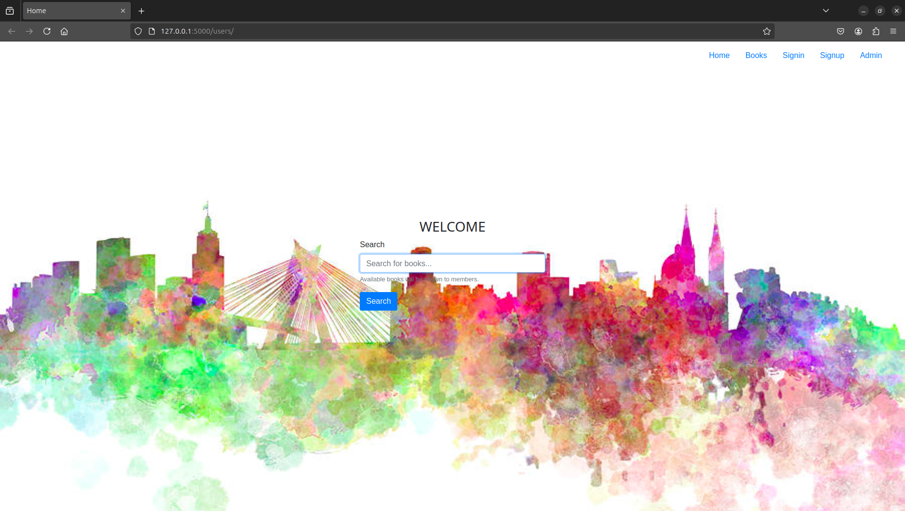

# Library Management System
A simple flask app to manage users along with mysql service




## Installation

To run the app flawlessly, satisfy the requirements
```bash
$ pip install -r requirements.txt
```

run this command to start the server
```bash
$ python -m flask run
```

or run this command to start the server
```bash
$ flask -app app run
```

run this command to start the server in debug mode
```bash
$ flask -app app --debug run
```